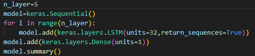
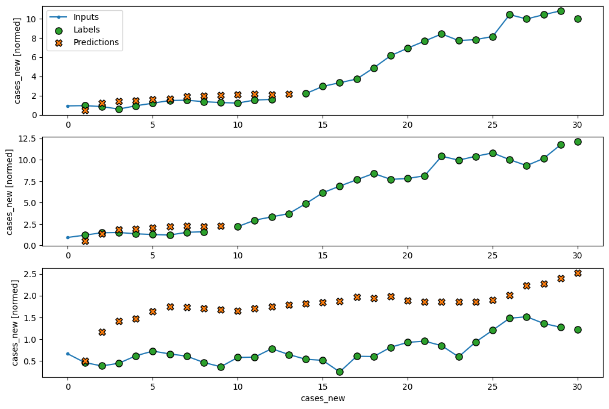

# Covid-19 New Cases Prediction

This project aims to predict the new cases of Covid-19 using historical data from Malaysia. The goal is to build a time series forecasting model using LSTM (Long Short-Term Memory) to predict the future cases based on past trends.

## Project Overview

This project uses machine learning techniques to predict future Covid-19 cases. The dataset contains historical information on Covid-19 cases, and the model uses a time series approach to forecast future values. The primary approach used is a Recurrent Neural Network (RNN) with LSTM cells to handle the sequential nature of the data.

### Key Steps:
- **Data Preprocessing:** Load, clean, and preprocess the data, handling missing values and normalization.
- **Model Creation:** Build an LSTM model with several layers for time series forecasting.
- **Model Training:** Train the model with the processed data and evaluate the performance.
- **Prediction:** Generate future predictions and visualize the results.
- **MLflow Integration:** Track model training and metrics using MLflow.

## Usage

1. **Data Loading:**
   The project loads the dataset `cases_malaysia_train.csv` and `cases_malaysia_test.csv` from the `dataset/` directory. Ensure that the data is in the correct format, with the columns `date`, `cases_new`, and other relevant features.

2. **Data Preprocessing:**
   The data is processed by converting the `date` column to datetime and handling any missing values. The `cases_new` column is converted to numeric values, and the dataset is split into training, validation, and test sets.

3. **Model Training:**
   The LSTM model is trained using the processed dataset. The model is built using the Keras library, with multiple LSTM layers and a dense output layer. The training process is tracked with MLflow.

4. **Predictions:**
   After training, the model is used to generate predictions for the test data and visualizations are plotted for analysis.

5. **Tracking with MLflow:**
   The project uses MLflow to track experiments, monitor training metrics, and store models. You can view the training progress and results via the MLflow UI.

## Data

The dataset used for this project is composed of historical Covid-19 data from Malaysia

[Data source](https://github.com/MoH-Malaysia/covid19-public) 

## Model

The model architecture is as follows:

- 5 LSTM layers (with 32 units) to process the sequential data.
- A Dense layer to output the final prediction (the number of new cases).
- The model is trained using the Mean Squared Error (MSE) loss function and the Adam optimizer.

Python libraries used:

- `keras`
- `tensorflow`
- `scikit-learn`
- `mlflow`
- `pandas`
- `numpy`
- `matplotlib`
- `seaborn`

## Results

The results are visualized using Matplotlib and Seaborn, showing the predicted vs. actual number of new cases. The training and validation performance are tracked and plotted. MLflow is used to monitor and log the experiments.

